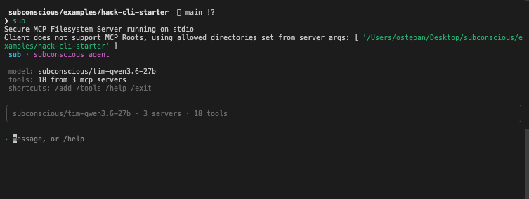

# sub · a Subconscious agent CLI starter

A clone-and-go starter for building agents on [Subconscious](https://www.subconscious.dev).
You get a good-looking terminal chat agent that connects to **MCP** tools and runs a
real ReAct loop — structured so you can drop your hackathon idea on top without
fighting the scaffold.



---

## Quickstart (the 5-minute path)

```bash
git clone https://github.com/subconscious-systems/subconscious
cd subconscious/examples/hack-cli-starter

npm install && npm run build && npm link   # `sub` is now on your PATH

export SUBCONSCIOUS_API_KEY=your_key        # grab one at subconscious.dev/platform

sub                                          # open the REPL
```

Now you're in the chat. The agent ships with **two built-in tools** — no setup:
a **filesystem** tool (it can read this folder) and an example **weather** tool. Ask:

```
› what files are in this project?      ← uses the filesystem tool
› what's the weather in Tokyo?         ← uses the example weather tool
```

Watch the `→`/`←` lines as it calls a tool and answers — that's the whole agent loop,
with zero setup.

> No key yet? Quit (`/exit`) and run `sub init` to store one.

---

## What just happened

Three ideas power this whole repo. They live in three files — read those and you
understand everything.

**1. The agent loop** ([`src/agent/loop.ts`](src/agent/loop.ts)) — the loop asks the
model "what next?"; if it wants a tool, we run it, feed the result back, and ask again
(Reason → Act → Observe) until it gives a final answer. Running this loop *ourselves* is
the whole game — [How tools work](#how-tools-work-why-its-built-this-way) explains why.

**2. MCP for tools** ([`src/mcp/client.ts`](src/mcp/client.ts)) — tools come from
[MCP](https://modelcontextprotocol.io) servers. The CLI is the MCP client: it
connects (stdio / SSE / HTTP), flattens every server's tools into one list with
`<server>__<tool>` names, and runs them on request. The list of tools the agent gets
lives in [`src/tools/index.ts`](src/tools/index.ts).

**3. Native function tools** — we hand the model our MCP tools as standard OpenAI
function tools (`tools: [...]`). When it wants one, the reply comes back with a
`tool_calls` array (name + JSON arguments) — no prose parsing, no guessing. We run
the tool and send the result back as a `role: "tool"` message.

---

## Tools

**Two tools are built in** (no setup) — both short files you can read and copy:
- **filesystem** ([`src/tools/filesystem.ts`](src/tools/filesystem.ts)) — read/write the
  folder you launched `sub` in (`sub --dir ~/code` to change it).
- **weather** ([`src/tools/weather.ts`](src/tools/weather.ts)) — calls an external API.

The agent's whole toolset is one list: [`src/tools/index.ts`](src/tools/index.ts).

### Add your own

Most hackathon projects are "an agent + one tool." A tool is a name + a description (the
agent reads it to decide when to use it) + a Zod input schema + a handler:

```ts
server.registerTool(
  "get_weather",                                            // the name the agent calls
  { description: "Current temperature for a city.", inputSchema: { city: z.string() } },
  async ({ city }) => ({ content: [{ type: "text", text: `It's warm in ${city}.` }] }),
);
```

Two steps:
1. Copy [`src/tools/weather.ts`](src/tools/weather.ts) → `src/tools/myTool.ts`; change the
   name / description / schema / handler.
2. Add a line to [`src/tools/index.ts`](src/tools/index.ts):
   ```ts
   bundledToolServer("mine", "myTool"),              // a tool you wrote
   serverFromUrl("https://mcp.deepwiki.com/mcp"),    // ...or a hosted server by URL (3rd arg = bearer token)
   ```

Rebuild (`npm run build`, or `npm run dev`) and the agent can call `mine__<toolName>`.

> Tools live in code (no runtime `add`) on purpose — one place to look, nothing to configure.

---

## Extending it

Everything you add follows one shape: **a folder + an `index.ts` registry — drop a file,
add one line.** (Tools work this way too — see [Tools](#tools) above.)

| Add a… | How |
|---|---|
| **Slash command** (`/x`) | copy [`slashCommands/_template.ts`](src/slashCommands/_template.ts) → add it to [`slashCommands/index.ts`](src/slashCommands/index.ts). `/help` lists it automatically. |
| **CLI command** (`sub x`) | copy [`commands/_template.ts`](src/commands/_template.ts) → add it to `COMMANDS` in [`commands/index.ts`](src/commands/index.ts). |
| **Personality** | edit the `PERSONA` string in [`src/prompt.ts`](src/prompt.ts). |
| **Config setting** | add a field to `ConfigSchema` in [`src/lib/config.ts`](src/lib/config.ts) — type-safe + persisted. |
| **MCP transport** | add one branch to `makeTransport` in [`src/mcp/client.ts`](src/mcp/client.ts). |
| **Progress display** | add an `AgentEvent` variant in [`src/agent/loop.ts`](src/agent/loop.ts) + a case in `EntryView` in [`src/components/Chat.tsx`](src/components/Chat.tsx). |

---

## How tools work (why it's built this way)

Subconscious exposes an **OpenAI-compatible** chat endpoint
(`https://api.subconscious.dev/v1`, model `subconscious/tim-qwen3.6-27b`). It speaks
the protocol you already know — including standard **function tools**: you pass a
`tools` array and the model replies with `tool_calls`.

What it does **not** do is *execute* those tools for you. So this CLI runs the loop
**client-side**: it's the MCP client that owns the tools, it passes them to the
model as OpenAI function tools, and when the model calls one it runs it and feeds
the result back (`role: "tool"`) — looping until the model gives a final answer.

That's the lesson worth taking to your own project: a small, explicit loop you
control beats a black box you can't.

---

## Stack

`commander` (CLI) · `ink` + `ink-text-input` + `ink-spinner` (TUI) · `openai` (model
client, pointed at Subconscious) · `@modelcontextprotocol/sdk` (MCP) · `conf` (config)
· `zod` (validation). Short on purpose — starters bloat fast.

## Acknowledgements & license

Built on [Subconscious](https://www.subconscious.dev) and the
[Model Context Protocol](https://modelcontextprotocol.io). MIT licensed — fork it,
break it, ship something.
